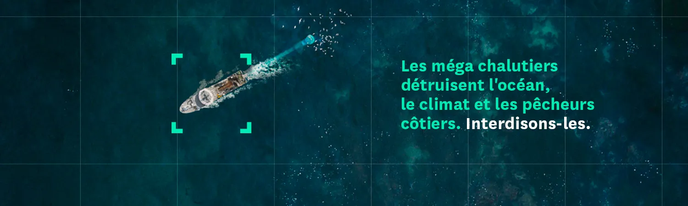

## What is Trawl Watch

**[Trawl Watch](https://twitter.com/TrawlWatch)** is an initiative launched by the **[Bloom Association](https://www.bloomassociation.org/en/)** to track and expose the most destructive fishing vessels. Inspired by L’[Avion de Bernard](https://www.instagram.com/laviondebernard/), which monitors the movements of private jets, **Trawl Watch** aims to make visible the impact of these massive trawlers on our oceans. These vessels, often referred to as _mégachalutiers_, deploy gigantic nets that can engulf marine life from the surface down to the ocean floor. The consequences are both ecological—as they devastate crucial nursery and breeding areas for marine animals—and social, as they deprive artisanal fishermen of a healthy marine ecosystem. The solution proposed by **Bloom** is to dismantle these industrial fishing ships and redistribute their quotas to small-scale fishers. A petition has been launched, and **Bloom** continues to track these megatrawlers while awaiting action from European institutions.

**Did you know that, in Europe, the largest fishing vessels, which represent 1% of the fleet, catch half of the fish?** These factory-vessels can measure up to 144 meters in length and catch 400,000 kilos of fish per day! This is as much as 1,000 small-scale fishing vessels in one day at sea.

**These veritable sea monsters are devastating Europe’s biodiversity and coastlines.** It is important to measure the scale of the damage: about 20 of these factory-vessels can obliterate hundreds of thousands of marine animals and biodiversity treasures in one day, including in the so-called ‘Marine Protected Areas’ of French territorial waters, which are not protected at all.

## What is Bloom Association

**BLOOM** is a non-profit organization founded in 2005 that works to preserve the marine environment and species from unnecessary destruction and to increase social benefits in the fishing sector. **BLOOM** wages awareness and advocacy campaigns in order to accelerate the adoption of concrete solutions for the ocean, humans and the climate. **BLOOM** carries out scientific research projects, independent studies and evaluations that highlight crucial and unaddressed issues such as the financing mechanisms of the fishing sector. **BLOOM**’s actions are meant for the general public as well as policy-makers and economic stakeholders.

## Installing Trawl Watch with Docker Compose

* Ensure [Docker](https://docs.docker.com/get-docker/) is installed.
* git clone https://github.com/dataforgoodfr/12_bloom.git
* cd 12_bloom
* docker compose build
* docker compose pull
* copy and paste bloom/env.template at the same level than docker-compose.yaml and rename it .env
* docker compose run --service-ports bloom /bin/bash
* streamlit run Trawlwatcher.py
* working mmsi : 261084090


## Installing Trawl Watch with `poetry`

### Prerequisites:

1. Python (≥ `3.10`) installed on your system.
2. Ensure [Docker](https://docs.docker.com/get-docker/) is installed.
3. Ensure you have `poetry` installed. If not, you can install them using `pip`.

```bash
pip install poetry
```

### Steps:

1. **Clone the GitHub Repository:**

   Clone the GitHub repository you want to install locally using the `git clone` command.

   ```bash
   git clone https://github.com/dataforgoodfr/12_bloom.git
   ```

2. **Navigate to the Repository Directory:**

   Use the `cd` command to navigate into the repository directory.

   ```bash
   cd 12_bloom/
   ```

3. **Configure `poetry` to create a Virtual Environment inside the project:**

   Ensure that poetry will create a `.venv` directory into the project with the command:

   ```bash
   poetry config virtualenvs.in-project true
   ```

4. **Install Project Dependencies using `poetry`:**

   Use `poetry` to install the project dependencies.

   ```bash
   poetry install
   ```

   This will read the `pyproject.toml` file in the repository and install all the dependencies specified.

5. **Make sure everything is all right using `poetry env info`:**

   ```bash
   poetry env info
   ```

   It should looks something likes:

   ```bash
   Virtualenv
   Python:         3.11.2
   Implementation: CPython
   Path:           /home/guillaume/12_bloom/.venv
   Executable:     /home/guillaume/12_bloom/.venv/bin/python
   Valid:          True

   System
   Platform:   linux
   OS:         posix
   Python:     3.11.2
   Path:       /usr
   Executable: /usr/bin/python3.11
   ```

6. **Activate the Virtual Environment:**

   Activate the virtual environment to work within its isolated environment.

   On Unix or MacOS:

   ```bash
   poetry shell
   ```

### Once you're done working with the project, deactivate the virtual environment.

```bash
deactivate
```

## More information can be found there

1. [Database initialisation and versioning](./docs/notes/database.initialisation.md) # outdated
2. [Development environment](./docs/notes/development.environment.md) # outdated
3. [Architecture description](./docs/notes/technical.architecture.md)
4. [Useful SQL examples](./docs/notes/sql.examples.md)

## FAQ

#todo
