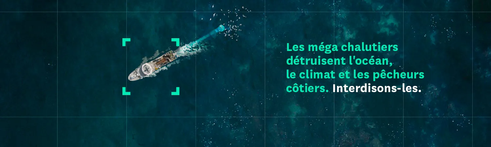
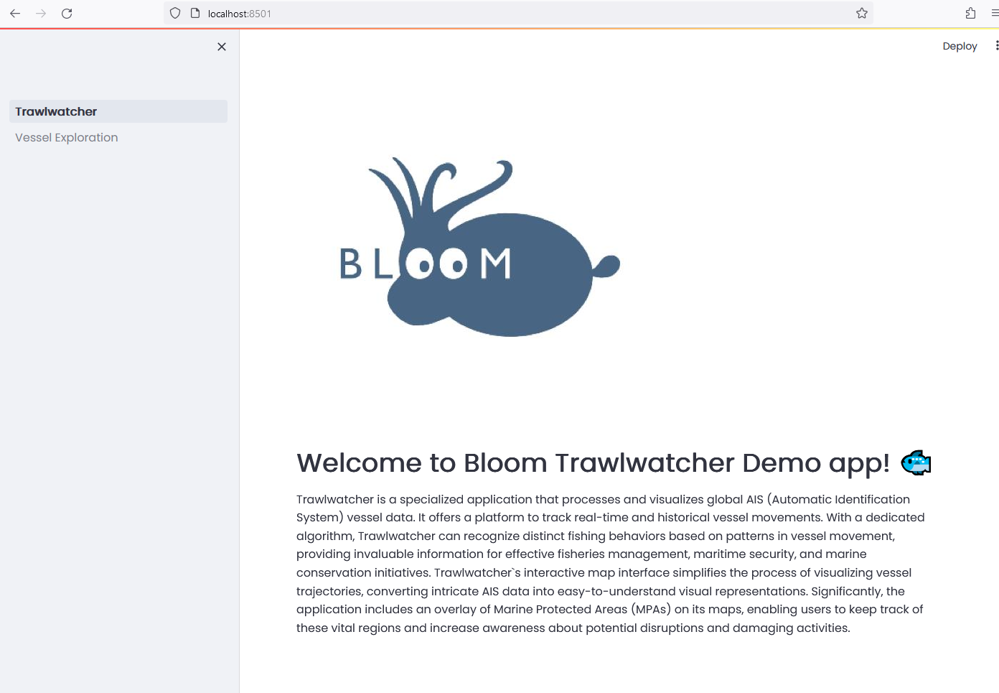

## What is Trawl Watch

**[Trawl Watch](https://twitter.com/TrawlWatch)** is an initiative launched by the **[Bloom Association](https://www.bloomassociation.org/en/)** to track and expose the most destructive fishing vessels. Inspired by L’[Avion de Bernard](https://www.instagram.com/laviondebernard/), which monitors the movements of private jets, **Trawl Watch** aims to make visible the impact of these massive trawlers on our oceans. These vessels, often referred to as _mégachalutiers_, deploy gigantic nets that can engulf marine life from the surface down to the ocean floor. The consequences are both ecological—as they devastate crucial nursery and breeding areas for marine animals—and social, as they deprive artisanal fishermen of a healthy marine ecosystem. The solution proposed by **Bloom** is to dismantle these industrial fishing ships and redistribute their quotas to small-scale fishers. A petition has been launched, and **Bloom** continues to track these megatrawlers while awaiting action from European institutions.

**Did you know that, in Europe, the largest fishing vessels, which represent 1% of the fleet, catch half of the fish?** These factory-vessels can measure up to 144 meters in length and catch 400,000 kilos of fish per day! This is as much as 1,000 small-scale fishing vessels in one day at sea.

**These veritable sea monsters are devastating Europe’s biodiversity and coastlines.** It is important to measure the scale of the damage: about 20 of these factory-vessels can obliterate hundreds of thousands of marine animals and biodiversity treasures in one day, including in the so-called ‘Marine Protected Areas’ of French territorial waters, which are not protected at all.

## What is Bloom Association

**BLOOM** is a non-profit organization founded in 2005 that works to preserve the marine environment and species from unnecessary destruction and to increase social benefits in the fishing sector. **BLOOM** wages awareness and advocacy campaigns in order to accelerate the adoption of concrete solutions for the ocean, humans and the climate. **BLOOM** carries out scientific research projects, independent studies and evaluations that highlight crucial and unaddressed issues such as the financing mechanisms of the fishing sector. **BLOOM**’s actions are meant for the general public as well as policy-makers and economic stakeholders.


**Table of contents**

- [Principles](#principles)
- [Requirements](#requirements)
- [Getting started](#getting-started)
- [Installing from PyPI](#installing-from-pypi)
- [Official source code](#official-source-code)
- [User Interface](#user-interface)
- [Semantic versioning](#semantic-versioning)
- [Version Life Cycle](#version-life-cycle)
- [Contributing](#contributing)
- [Who uses Trawl Watch?](#who-uses-trawl-watch)
- [Who maintains Trawl Watch?](#who-maintains-traw-watch)
- [What goes into the next release?](#what-goes-into-the-next-release)
- [Can I use the Trawl Watch logo in my presentation?](#can-i-use-the-trawl-watch-logo-in-my-presentation)
- [Links](#links)
- [Sponsors](#sponsors)

## Principles

#TODO

## Requirements

Bloom is tested with:

|             | Main version (dev)           | Stable version (1.0.0) |
|-------------|------------------------------|------------------------|
| Python      | 3.8, 3.9, 3.10, 3.11         | 3.8, 3.9, 3.10, 3.11   |
| Platform    | AMD64/ARM64(\*)              | AMD64/ARM64(\*)        |
| Docker      | 24                           | 24                     |
| PostgreSQL  | 13                           | 13                     |

## Getting started
### Clone the Bloom application repository

```bash
    git clone https://github.com/dataforgoodfr/12_bloom.git
    cd 12_bloom
```

### With Docker/Docker Compose stack
#### Prerequistes
* **Docker Engine** (version >= **18.06.0**) with **Compose** plugin

#### Building image

```bash
    docker compose build
```

> When official Docker image will be available, the building step could be optionnal for user as docker compose up will pull official image from repository

#### Starting the application

```bash
    docker compose up
```

You can now jump to [Use the Bloom Application](#use-the-bloom-application)

### On local machine
#### Prerequistes
* **Python**: 3.9, 3.10, 3.11
* **Postgresql**: 12, 13, 14, 15, 16

You must have a functionnal PostgreSQL instance with connexion informations (database server hostname or ip, user, password, database name, port to use)

#### Install with Poetry

```bash
    # Install poetry
    pip install --user "poetry==1.8.1"
    # Ensure that poetry will create a `.venv` directory into the project with the command
    poetry config virtualenvs.in-project true
    # Install dependencies from pyproject.toml
    poetry install
    # Make sure everything is all right using
    poetry env info
    # Enable virtual poetry project environment
    poetry shell
    # TODO configure cron
```
    
#### Minimal configuration
```bash
    # TODO if needed
```

#### Starting the application
```bash
    source /venv/bin/activate
    python src/Trawlwatcher.py
```

You can now jump to [Use the Bloom Application](#use-the-bloom-application)

### Use the Bloom Application

#### Load demonstration data
To use Trawl Watch application, some data have to be initialy loaded for demonstration. As these data are protected and can't be publicly published, you just have to contact the Trawl Watch application team. Informations on [Who maintains Trawl Watch?](#who-maintains-traw-watch)
After having succeed with [With Docker/Docker Compose stack](#with-docker) or [On local machine](#on-local-machine) installation, you should now access the Bloom application with you favorite web browser 
* Access to http://localhost:8501

* Navigate to "Vessel Exploration"
* #TODO add screenshot
* Enter MMSI 261084090 as example
* Clic on "Load"
* You can select voyage_id and view track of vessel

## Contributing

Want to help build Bloom Application Check out our [contributing documentation](https://github.com/dataforgoodfr/12_bloom/tree/main/docs/contributing/README.md).

Official Docker (container) images for Bloom Application are described in [images](https://github.com/dataforgoodfr/12_bloom/tree/main/docker/).

## More information can be found there

1. [Database initialisation](./docs/notes/database.initialisation.md)
2. [Development environment](./docs/notes/development.environment.md) # outdated
3. [Architecture description](./docs/notes/technical.architecture.md)
4. [Useful SQL examples](./docs/notes/sql.examples.md)

## FAQ

#todo
