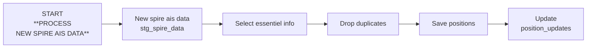

# Logique de traitement des nouvelles données AIS et création des positions

## Périodicité
* À chaque call API (toutes les 15 min)

## Description du processus

Ne traiter que les données Spire qui ont été mises à jour : spire_ais_data.position_update_timestamp > position_updates.point_in_time

