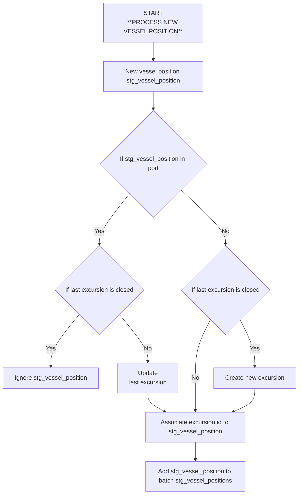

# Logique de traitement des positions pour la création des segments, des excursions et calcul des métriques

**ATTENTION : dans cette logique, on ne prend pas en compte un recalcul des excursions sur la base de `dim_vessel_source_mapping`.
À modifier par la suite en se basant sur [#428](https://github.com/dataforgoodfr/12_bloom/pulls/428)**

## Périodicité
* À chaque call API (toutes les 15 min)
* pour recalcul des trajectoires :
    - par `vessel_id`
    - par batch temporel

## Description du processus par vessel_id

