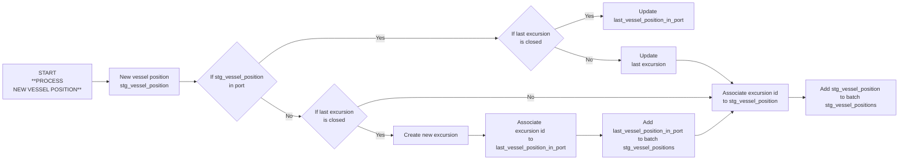

# Logique de traitement des positions pour la création des segments, des excursions et calcul des métriques

**ATTENTION : dans cette logique, on ne prend pas en compte un recalcul des excursions sur la base de `dim_vessel_source_mapping`.
À modifier par la suite en se basant sur [#428](https://github.com/dataforgoodfr/12_bloom/pulls/428)**

## Périodicité
* À chaque call API (toutes les 15 min)
* pour recalcul des trajectoires :
    - par `vessel_id`
    - par batch temporel

## Description du processus

### Etape 1 : association des positions aux excursions
Positions créées après task_executions.point_in_time

### Etape 2 : création des segments et mise à jour des excursions

Propriétés d'un segment à calculer : distance, duration, average_speed, in_amp_zone, in_zone_with_no_fishing_rights, in_territorial_waters

ATTENTION : les règles de pêche dans une zone sont dépendantes du pavillon du navire. Toutefois, un navire peut changer de pavillon. Ses droits de pêche par zone sont donc ancrés dans le temps. 
Pour l'instant, nous utilisons le `dim_vessel.country_iso3` mais il faudra réflechir à changer d'angle pour garder en mémoire à quels pays appartenait un navire et quand (proposition dans [#428](https://github.com/dataforgoodfr/12_bloom/pulls/428))

```mermaid
graph LR;
    ISTART[START<br>**PROCESS <br>BATCH VESSEL POSITIONS**]-->I000
    I000[New vessel positions  <br>stg_vessel_positions]-->I002
    I001[Add end position of  <br>last vessel segments]-->I002
    I002[Batch vessel positions]
    I002-->I003[Group stg_vessel_positions  <br>by excursion id]
    I003-->I004[For each group]
    I004-->I005{If size group > 1}
    I005-->|Yes|I006[Convert to segments]
    I005-->|No|I007[Duplicate position  <br>with lag -1s]-->I006
    I006-->I008[Concatenate segments]
    I008-->I014[Compute segments <br>variables]
    I014-->I009[Create segments and <br>segment-zone relations]
    I009-->I013[Calculate metrics*]
    I013-->I010[Update last segments]
    I010-->I011[Update excursions]
    I011-->I015[Update task_executions]
```

*processus indépendant de la création des segments et des excursions
