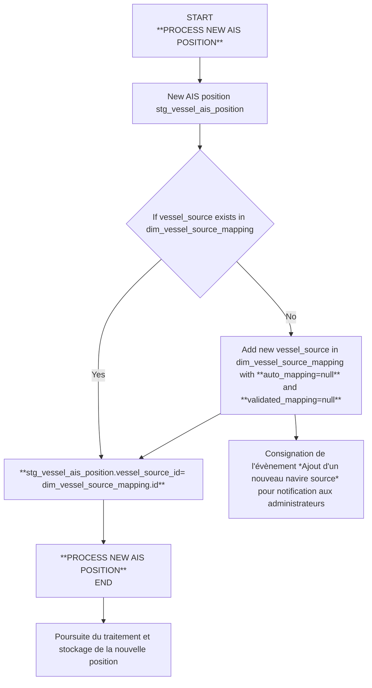
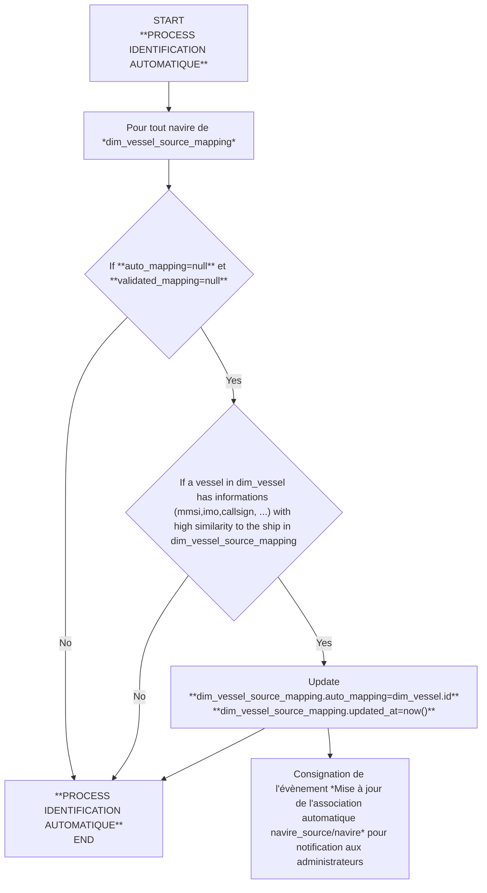
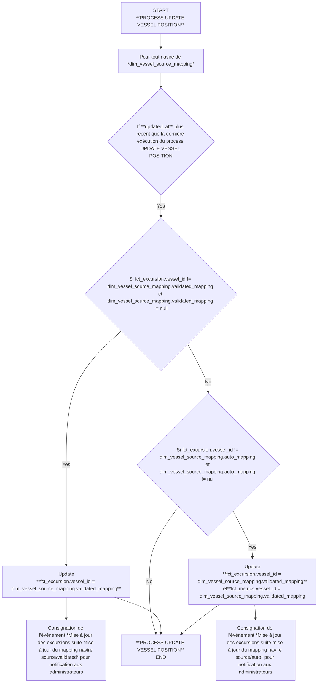
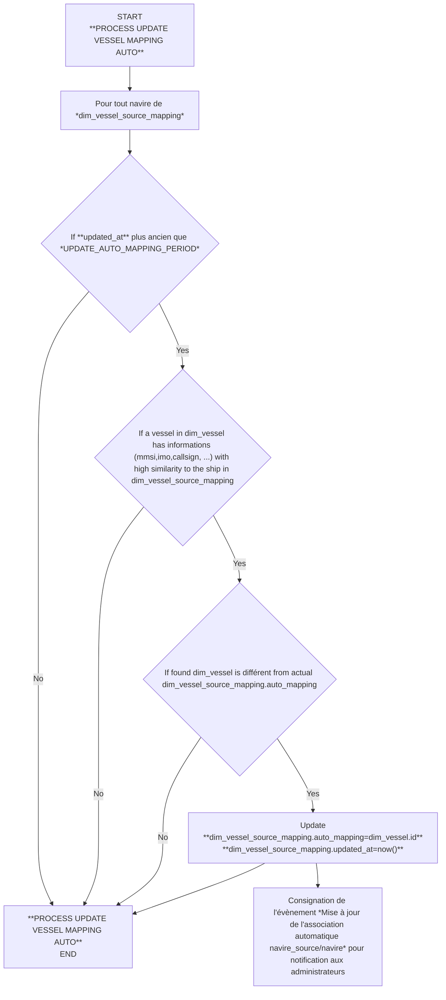
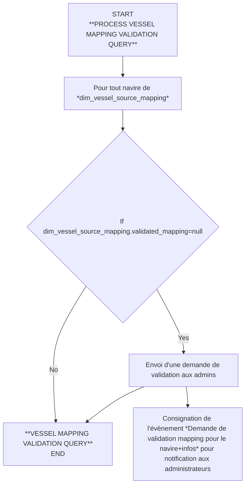
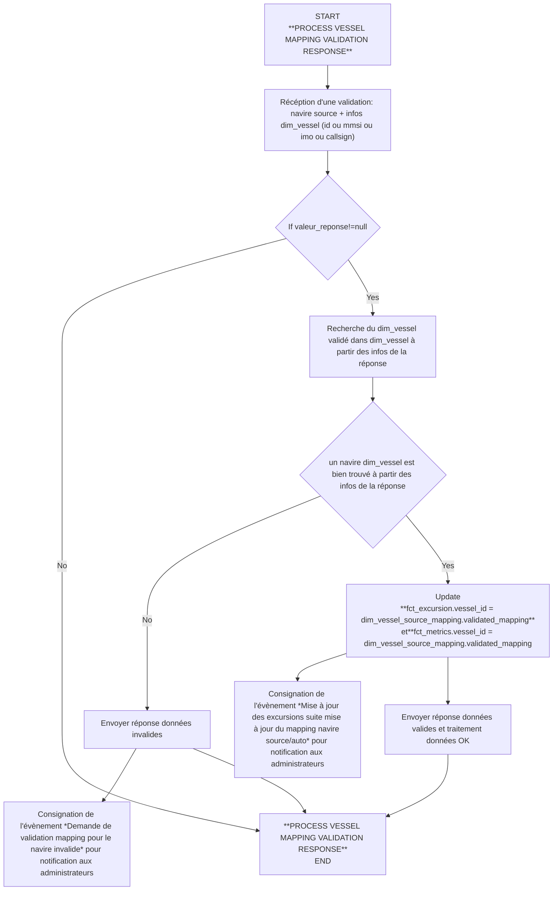

# Amélioration de l'identification des navires

## Problématique

## Proposition

* Identifiant source d'un navire: combinaison mmsi,imo,callsign (et + si judicieux) issues de la position AIS de la source (Spire ou autre)
* Identifiant validé d'un navire: navire stocké dans la dimension *dim_vessel* qui aura été validé manuellement (ou automatiquement si critères suffisants)
* Nouvelle position AIS: Position AIS issue d'une source (Spire ou autre) contenant une combinaison d'identification d'un navire, un ou plusieurs horadatage (bateau, tracker, ...) et une position géographique
* Mapping automatique: association d'un identifiant source d'un navire à un identifiant validé de la dimension *dim_vessel* issue d'un traitement automatique
* Mapping manuel: association d'un identifiant source d'un navire à un identifiant validé de la dimension *dim_vessel* issue d'une action manuel après analyse

Création d'une table de dimension *"dim_vessel_source_mapping"* qui stocke toutes les combinaisons d'identification trouvées dans les positions AIS traitées et permet dans un premier temps d'y associer/mapper un navire de dim_vessel automatiquement si cela est possible ainsi qu'un navire de dim_vessel validé manuellement si nécessaire (process à définir mais potentiellement par mail+lien de validation via API)
Si il n'est pas possible d'associer automatiquement un navire de dim_vessel sur la base des informations contenu dans la position AIS, les positions continuent d'être stockées dans fct_position mais ne seront associées qu'au navire *dim_vessel_source_mapping.id* qui aura été créé à la première apparition de cette identifiant source

### Etape 1: Identification du navire au niveau de la table dim_vessel_source_mapping
* Périodicité: A chaque nouvelle position traitée
* Description du process:

**A NOTER :**
* Afin d'alléger au maximum le process d'intégration des positions, on ne fait qu'identifier le navie avec sa combinaison source sans essayer de lui associer un navire de dim_vessel pour le moment pour éviter des traitement qui pourrait allonger le temps d'intégration d'une nouvelle position
### Etape 2: Association automatique dim_vessel_source_mapping => dim_vessel si possible
* Périodicité:

En même temps que l'étape 1 si jugé utile et nécessaire et si les performances le permettent, sinon définir la périodicité

### Etape 3: Mise à jour des excursions avec le dim_vessel nouvellement associé

Actuellement le navire dim_vessel est exclusivement associé à la table fct_excursion, pour appliquer ce nouveau process d'identification il faudrait y ajouter la colonne vessel_source_id: clé étrangère vers la table dim_vessel_source_mapping
Dans un premier temps, et sans processus d'identification ayant abouti (automatique et/ou manuel), on se retrouvera avec des excursions dont le fct_excursion.vessel_id=null par contre il doit systématiquement y avoir un fct_excursion.vessel_source_id!=null pointant vers dim_vessel_source_mapping.id
Dès qu'un des processus d'identification aura abouti (automatique et/ou manuelle), la mise à jour de la table dim_vessel_source_mapping engendrera la maise à jour des toutes les positions ayant pour vessel_source_id le navire mise à jour dans la table dim_vessel_source_mapping et ayant pour fct_excursion.vessel_id un navire null ou différent de celui qui a été mise à jour (dim_vessel_source_mapping.auto_mapping ou dim_vessel_source_mapping.validated_mapping si existant et prioritaire)

* Périodicité:
Ce traitement parcours toutes les positions d'un navire dont les positions ont été staockées sans navire valide de dim_vessel ou avec un navire dim_vessel différent.
Ce processus peut être long et doit donc être décorrelé des traitements périodique d'intégration des positions voir idéalement sur une machine différente.
Le processus est réversible en remodifiant le mapping manuel dans dim_vessel_source_mapping
 
* Description du process:

### Etape 4: Remise en question des associations automatiques

* Périodicité:

A minima lors d'une modification de dim_vessel ou de l'algorithme d'association automatique

* Description du process:

### Etape 5: Process de validation du mapping manuel par un·e administrateur·rice

* Périodicité:

A définir

* Description du process:

  
